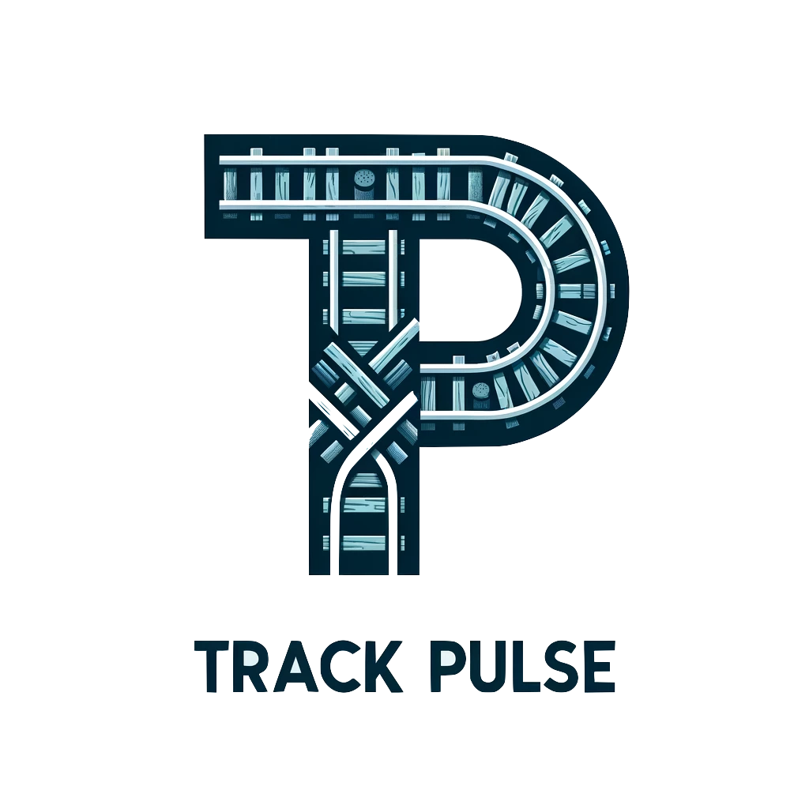

<h1>
   Track Pulse
</h1>

## Prior work

- [Automated Track Change Detection Technology for Enhanced Railroad Safety Assessment](https://railroads.dot.gov/sites/fra.dot.gov/files/2023-04/UIUC%20Change%20Detection.pdf)


## Data pipeline

1. Upload image and metadata to GCS bucket
1. Trigger cloud function
1. Run image through segmentation (ideally panoptic)
1. Upload to db (postgres --> bigquery)


## Database Tables

### Image
Table for images of tracks


|Column|Datatype|description|
|---:|:---|:---|
|id|-|-|
|created_on|datetime|date of image|
|lat|FLOAT| latitude|
|lon|FLOAT| logitude|
||||

### Depth Map
|Column|Datatype|description|
|---:|:---|:---|
|id|-|-|
|created_on|datetime|date of image|
|lat|FLOAT| latitude|
|lon|FLOAT| logitude|
||||

### SegmentationAlgorithm
Table for tracking versions of segmentation algorithm

### ObjectTypes
Categories of Objects that can be classified

### ObjectObservation

Instances of objects

|Column|DataType|description|
|---:|:---|:---|
|id|-|-|
|classification_algorithm_id|ref||
|image_id|ref||
|object_type|ref||
|mask_fp|path|Path to location saved of the mask where the object is located in the image|
|centroid_lat|float|latitude of centroid|
|centroid_lon|float|longitude of centroid|

## ObjectInstance

|Column|DataType|description|
|---:|:---|:---|
|id|-|-|
|object_observation_ids|references one to M||


## Running local database

To run locally for dev us docker

```bash
docker run --name tp-db -p 5432:5432 -e POSTGRES_PASSWORD=postgres  -d --rm postgres
```

