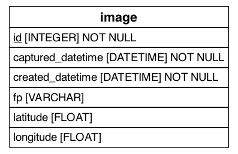

<h1>
   Track Pulse
</h1>

## Prior work

- [Automated Track Change Detection Technology for Enhanced Railroad Safety Assessment](https://railroads.dot.gov/sites/fra.dot.gov/files/2023-04/UIUC%20Change%20Detection.pdf)
- [Development of Track Component Health Indices Using Image Based Railway Track Inspection](https://railtec.illinois.edu/wp/wp-content/uploads/germoglio-barbosa-et-al-2024-development-of-track-component-health-indices-using-image-based-railway-track-inspection.pdf)


## Data pipeline

1. Upload image and metadata to GCS bucket
1. Trigger cloud function
1. Run image through segmentation (ideally panoptic)
1. Upload to db (postgres --> bigquery)


## Database Tables

### Image
Table for images of tracks


|Column|Datatype|description|
|---:|:---|:---|
|id|-|-|
|created_on|datetime|date of image|
|lat|FLOAT| latitude|
|lon|FLOAT| logitude|
||||

### Depth Map
|Column|Datatype|description|
|---:|:---|:---|
|id|-|-|
|created_on|datetime|date of image|
|lat|FLOAT| latitude|
|lon|FLOAT| logitude|
||||

### SegmentationAlgorithm
Table for tracking versions of segmentation algorithm

### ObjectTypes
Categories of Objects that can be classified

### ObjectObservation

Instances of objects

|Column|DataType|description|
|---:|:---|:---|
|id|-|-|
|classification_algorithm_id|ref||
|image_id|ref||
|object_type|ref||
|mask_fp|path|Path to location saved of the mask where the object is located in the image|
|centroid_lat|float|latitude of centroid|
|centroid_lon|float|longitude of centroid|

## ObjectInstance

|Column|DataType|description|
|---:|:---|:---|
|id|-|-|
|object_observation_ids|references one to M||


## Running local database

To run locally for dev us docker

```bash
docker run --name tp-db -p 5432:5432 -e POSTGRES_PASSWORD=postgres  -d --rm postgres
```


## DB Schema Update and Migrations

After any changes to "db/models/*" run the following commands to create a migration and apply it to the database:

```bash
alembic revision --autogenerate -m "message"
alembic upgrade head
```

After remote changes to the database you should commit the alembic version file:

```bash
git add alembic/versions/*
git commit -m "message"
```

You will also need to update the api to match the database changes and should update the documentation to reflect the changes (including the ER diagram).

Change ER diagram by running `database/imgs/make_diagram.py`

## ER diagram



## Make pipeline

1. Make a bucket
1. Make a cloud function
  - Would be great to have it a part of this repo so that we can use the schema
1. Make some test uploads


# XML Structure

The xml files have the following structure

```json
{
    "DataFormat": "1.1",
    "SurveyInfo": "dict",
    "SectionInfo": "dict",
    "ProcessingInformation": "dict",
    "GPSInformation": "dict",
    "SectionPosition": "dict",
    "SectionGnssBasedUtcTimeBeginEnd": "dict",
    "ResultImageInformation": "dict",
    "RailSystemInformation": "dict",
    "SystemData": "dict",
    "GeometryReferenceCalibrationParams": "dict"
}
```

I have inspected two files to see what would be a unique id

It appears that:
- SectionInfo.SurveyID
- SectionInfo.SectionID

Together these will be unique


Schema work is a headache!

Break it down and just do "SurveyInfo"

Seems like we should make a table for each thing we want and include SurveyId.SectionId as a key and partition
This will allow for linking everything and only querying subsets

later we can add a table for "trackID" and "mile post" which can be joined to the others when available

I propose we make a table for

- SectionInformation
- Ballast
- Anchor
- Fastener
- TiePlate ( Are there other possible RailSupport?)
- Spike
- GageWidthMeasurement
- Jointbar
- Rail
- RailWearParam
- Tie
  - These also have spikes, ballast, ties... what to do here?
- UDFO

Each of these will get schemas as is and add "SurveyID" "SectionID"


